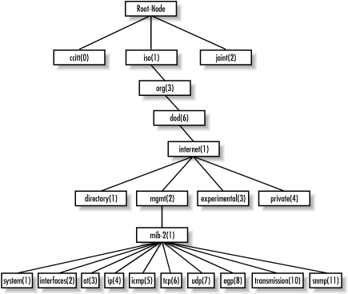
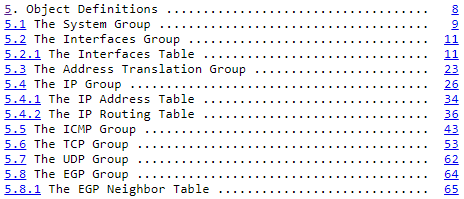
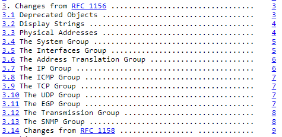

# Tutoria para ubuntu y python3 y pip3

## Usar de virtualenv

Crear un entorno virtual
>virtualenv venv

Entrar al entorno virtual
>source venv/bin/activate

## Instalar en la maquina

>sudo apt-get install librrd-dev libpython3-dev

## instalar dentro del entorno

Se recomienda instalar los que viene en requirements.txt.Para hacerlo escribir lo sig:
>pip install -r requirements.txt

### Pasos que se hicieron en la creacion del proyecto
>pip3 install rrdtool

>pip3 install pysnmp

# Sobre la materia

### Referencias

SMI_V1: [rfc1155:Estructura e identificación de la información de gestión para Internet basadas en TCP/IP](https://datatracker.ietf.org/doc/html/rfc1155).

SMI_V2: [rfc2578:Estructura de Información de Gestión Versión 2](https://datatracker.ietf.org/doc/html/rfc2578).

[rfc2579:Convenciones textuales para SMIv2](https://datatracker.ietf.org/doc/html/rfc2579).

[rfc1212:Definiciones concisas de MIB](https://datatracker.ietf.org/doc/html/rfc1212).

[rfc1156:Base de información de gestión para la gestión de redes de Internet basadas en TCP/IP](https://datatracker.ietf.org/doc/html/rfc1156).

[rfc1157:Un protocolo simple de administración de red (SNMP)](https://datatracker.ietf.org/doc/html/rfc1157).

[rfc1158:Base de información de gestión para la gestión de redes de Internet basadas en TCP/IP: MIB-II](https://datatracker.ietf.org/doc/html/rfc1158).

[rfc1213:Base de información de gestión para la gestión de redes de Internet basadas en TCP/IP: MIB-II (continuacion?)](https://datatracker.ietf.org/doc/html/rfc1213).

En resumen se puede ver la estreuctura general de la MIB para poder recorrerla

En esta liga nos llevara a la seccion donde se describen los nodos de Sistem hasta EGP que corresponden a la version 1

SNMP_v1: [RFC1156 Seccion 5 (objetos)](https://datatracker.ietf.org/doc/html/rfc1156#section-5).

En esta liga nos llevara a la seccion donde se describen los nodos de Transimison hasta SNMP que corresponden a la version 2 y nuevos cambios.

SNMP_v2: [RFC1213 seccion 3 (Cambios a la RFC 1156)](https://datatracker.ietf.org/doc/html/rfc1213#section-3)

SNMP_v3: RFC3411,RFC3416
